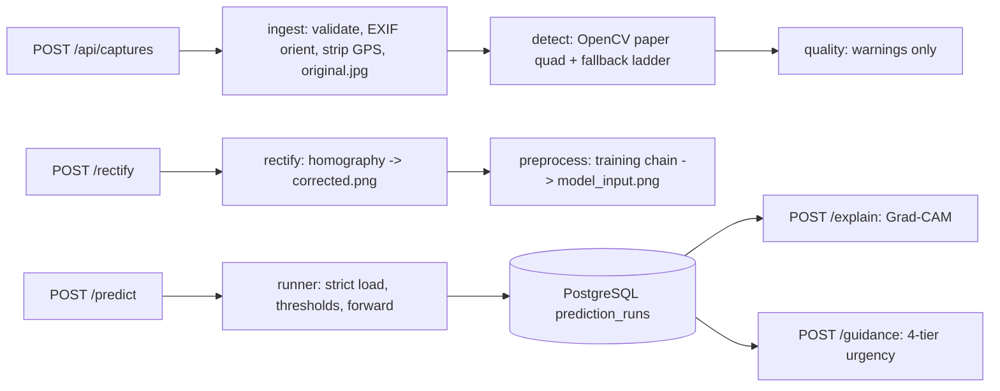

# Repository Guidelines

Last verified against the tree: **2026-10-08**.

## Project Overview

CardioSentry serves trained 12-lead ECG multi-label classifiers to a phone on the LAN. You photograph a printed ECG sheet, and the backend detects the paper, rectifies it, rebuilds the exact training input, and runs the model. It can also explain the result with Grad-CAM and give a four-tier clinical-urgency guidance read. It is a research/validation tool. Its single-process FastAPI server serves both `/api` and the built React PWA.

Read these before re-deriving anything from source:

- `README.md`: stages, layout, persistence, security and the non-negotiables (§The non-negotiables). Trust the tree if a model listing drifts.
- `models/README.md`: descriptor format and the 7-step "add a model" checklist.
- `backend/arch/README.md`: vendoring provenance and the only 3 allowed deviations.
- `docs/clinical-guidance.md`: guidance tiers and rules.
- `../CARDIOSENTRY_WEB_APP_PLAN.md`: the spec that `(plan §n.n)` comments cite. Grep a heading. Don't read all 1105 lines. Its "no relational database" requirement and Q9 are superseded by the PostgreSQL migration.

## Architecture & Data Flow



- **Stages are separate HTTP calls**: upload, then rectify, then predict. The user can fix corners in `CornerEditScreen`/`QuadEditor` between upload and rectify.
- **Lifespan** (`backend/main.py`): `create_state()` → connect + migrate DB → create `admin`/`admin` only if the permanent `admin` account id is missing (WARNING log) → construct account/record stores → discover and validate `models/*.yaml` → load the active model → warm-up forward → **warn-only** self-check against `tests/fixtures/corpus_sheet.jpg` → disk check → print LAN URL + QR → mount `frontend/dist/`. Shutdown closes the pool.
- **State/DI**: there is no `fastapi.Depends`. An `AppState` dataclass lives on `app.state.csd`, and routes call `st = get_state(request)` (`backend/api/state.py`). Lazy model loads take `AppState._load_lock`.
- **Concurrency**: route handlers are sync `def` and run in Starlette's threadpool, except `create_capture`, which awaits `file.read()`. The async `auth_gate` middleware dispatches `AccountStore.user_for_token` with `run_in_threadpool`; never block its event loop on a database call. Every forward runs under `with lm.lock:` (`services/runner.py`). Keep new handlers sync unless they must await.
- **Model is data, not code**: a descriptor `models/<id>.yaml` names an `arch.<pkg>` module, the weights, labels, thresholds, preprocess geometry, explain layer and verify block. Swapping models means repointing the `models/active.yaml` symlink. If a swap seems to need Python edits, that is the bug.
- **Persistence**: local PostgreSQL is the record source of truth (schema v1): `accounts`, `sessions`, `captures`, `prediction_runs`, `explain_runs`, `schema_migrations`. Capture/prediction/explain records are JSONB through `RecordStore`; run rows and the capture's run-id lists change transactionally. Images and optional arrays stay on disk:

  ```
  captures/YYYY-MM-DD/YYYY-MM-DD_HHMMSS_xxxxxx/
    original.jpg preview.jpg overlay.jpg corrected.png model_input.png
    explain/xai_<ts>_<method>_<model_id>/{<method>_<LABEL>_{heatmap,overlay}.png, raw.npz (optional)}
  ```
  `captures.owner_id = owner_of(record)` uses the immutable account id in `record.owner`, falling back to the permanent `admin` id for missing/null owners. Imported record JSON is not backfilled (NUL padding is stripped). DELETE sets `captures.trashed_utc` and moves the folder to `captures/_trash/<date>/<id>/`; reads exclude trashed rows. Legacy `capture.json`, run JSON and explain `record.json` were imported, verified and moved to the owner-only archive `~/.local/share/cardiosentry/legacy-json/` (PHI), outside the repo; only the manual importer reads extracted legacy JSON as a restore source, never the app.
- **Frontend** holds no model knowledge. Labels, thresholds, guidance config and the privacy-notice version all come from `GET /api/config`. `screens/AuthScreen.tsx` handles sign in/register; the navbar **Settings** button (or mobile hamburger menu) opens `#/settings` (`screens/AccountScreen.tsx`) to edit the username/password and sign out. The topbar username is plain display text; Sign out lives inside Settings. Both auth and account share `components/PasswordInput.tsx`.

## Key Directories

| Path | Purpose |
|---|---|
| `backend/api/` | Thin routers. One file per area: `auth`, `captures`, `explain` (also owns `GET /api/models/{id}/layers`), `guidance`, `models`, `config`, `health`; `state.py` holds the singletons |
| `backend/services/` | All the real work: `db`, `records`, `accounts`, `ingest`, `detect`, `rectify`, `preprocess`, `quality`, `registry`, `runner`, `explain`, `guidance`, `storage` |
| `backend/services/db.py` | Local-only psycopg pool, readable startup failures without secrets, versioned `MIGRATIONS` under an advisory transaction lock |
| `backend/services/records.py` | `RecordStore`: JSONB records, indexed ownership/live-row queries, locked updates, transactional run indexes, soft delete, idempotent import and NUL stripping |
| `backend/services/accounts.py` | PostgreSQL `accounts`/`sessions`, salted PBKDF2-SHA256 (600k), 30-day sessions, immutable account ids, startup admin creation and `owner_of`. Rename preserves sessions; password change revokes other sessions transactionally |
| `backend/services/storage.py` | Image/binary directories, id regexes, file-serving whitelists and trash moves; no JSON record readers/writers |
| `backend/schemas/` | Pydantic v2 request/response and stored record shapes; `model_descriptor.py` |
| `backend/arch/<pkg>/` | Vendored training-time `nn.Module` code, byte-identical except for 3 documented deviations |
| `models/` | `<id>.yaml` descriptors, the `active.yaml` symlink, `weights/` (gitignored) |
| `frontend/src/` | `App.tsx` (hash router), `AppContext.ts`, `screens/`, `components/`, `api/{client,types}.ts`, `styles.css` |
| `scripts/` | `verify_model.py`, `reprocess.py`, `export_dataset.py`, `import_filesystem.py`, `make_cert.sh` |
| `tests/` | pytest suite, `make_fixtures.py`, checked-in `fixtures/` |
| `captures/` | Runtime PHI images/binary arrays only. Gitignored. Credential/session hashes live in PostgreSQL; legacy JSON is archived outside the repo. Never commit it or write test output there |
| `docs/` | `clinical-guidance.md`, `system-flowchart/` (HTML source → PDF/PNG) |

### API surface — accounts and ownership

| Method & path | Router | Session |
|---|---|---|
| `POST /api/auth/register` | `auth.py` | Public; creates the account and signs in (`201 {"username"}`) |
| `POST /api/auth/login` | `auth.py` | Public; signs in (`200 {"username"}`) |
| `POST /api/auth/logout` | `auth.py` | Public; revokes the session and clears the cookie (`200 {"logged_out": true}`) |
| `GET /api/auth/me` | `auth.py` | Required; returns `{"username"}` |
| `PATCH /api/auth/account` | `auth.py` | Required; changes username and/or password with `current_password`; returns `{"username"}` |

`main.py`'s `auth_gate` returns `401 AUTH_REQUIRED` without a valid session on every `/api/*` path except health, config, login, register and logout. The optional `CARDIOSENTRY_APP_TOKEN` gate still applies in addition. All capture routes (including files, guidance and explain) are owner-scoped; another user's capture returns `404 CAPTURE_NOT_FOUND`. Listing filters by owner before paging; admin has no access to other users' captures.

Explain metadata comes from `GET /api/captures/{id}/explain/{xid}`; `GET …/explain/{xid}/files/record.json` now returns `404 UNKNOWN_FILE`. Only attribution PNGs and optional `raw.npz` are file-served.

## Development Commands

There is **no virtualenv and no `python` binary**. Use system `python3` and run from this directory. Configure `DATABASE_URL` or `CARDIOSENTRY_DATABASE_URL` in `.env`; the prefixed alias wins. The target is local `127.0.0.1:5432/cardiosentry (user cardiosentry)`; never print the secret URL.

```bash
docker start postgres-db-cardiosentry            # start the existing local PostgreSQL container if stopped
python3 scripts/import_filesystem.py --data-dir <dir>   # legacy JSON import/restore into an empty DB, before first boot; idempotent
python3 -m backend.main                          # serve on 0.0.0.0:8000, prints LAN URL + QR
cd frontend && npm run dev                       # Vite dev server, proxies /api -> 127.0.0.1:8000
cd frontend && npm run build                     # tsc --noEmit && vite build -> frontend/dist/ (served by backend)
python3 -m pytest -q                             # full suite, real CPU model, takes minutes
python3 scripts/verify_model.py [--model <id>]   # strict load + score drift vs descriptor verify block; exit 1 on drift
python3 scripts/reprocess.py --all --model <id> [--force|--dry-run]   # re-score stored captures
python3 scripts/export_dataset.py --out captures_export.csv
./scripts/make_cert.sh                           # mkcert -> certs/{key,cert}.pem (HTTPS for phone camera + PWA)
```

The legacy JSON import was completed and verified on 2026-10-08. To restore, extract the archive and pass that directory as `--data-dir` before an empty database's first app boot; see README §Security & privacy, **Legacy JSON archive**, for checksums and commands. The importer leaves source files untouched and never overwrites database rows. If an extracted legacy tree contains `accounts.json`, importing before startup seeds admin preserves its credentials; this archive contains no account file. New installations without legacy data need no import.

For HTTPS, run `uvicorn backend.main:app --host 0.0.0.0 --port 8000 --ssl-keyfile certs/key.pem --ssl-certfile certs/cert.pem`. TLS is not a setting.

To check that the app boots without starting a server:

```python
from fastapi.testclient import TestClient
from backend.main import app
with TestClient(app) as c: print(c.get("/api/health").json())
```

A healthy boot logs `verify_model self-check passed: max |Δ| = …`. The check only warns, so read the log.

There is **no lint or format tooling**: no ruff, black, mypy, ESLint or Prettier. `tsc` strict mode in `npm run build` is the only static gate.

## Code Conventions & Common Patterns

- **Python**: every module starts with `from __future__ import annotations`. Use full type hints and `logging.getLogger("cardiosentry.<area>")`. Cite the spec in comments as `(plan §n.n)`.
- **Errors**: raise `ApiError(status_code, code, message)` or `NotFound` from `backend/errors.py`. Handlers in `main.py` serialize them to `{"code", "message"}`. Codes are stable UPPER_SNAKE (`CAPTURE_NOT_FOUND`, `INFERENCE_FAILED`, `STORAGE_FULL`, `GUIDANCE_UNSUPPORTED_MODEL`). When you add a code, also map it in `frontend/src/api/client.ts`.
- **Schemas**: Pydantic v2 only (`model_validate`, `model_dump(mode="json")`). Name them `XxxRequest` / `XxxResponse` / `XxxSummary` / `XxxRecord`.
- **Settings**: all config lives in `backend/settings.py` (pydantic-settings, prefix `CARDIOSENTRY_`, reads `./.env`). `database_url` is a `SecretStr` with `CARDIOSENTRY_DATABASE_URL` / `DATABASE_URL` aliases (prefixed name wins). Keep `.env.example` in sync, because it is the documentation. Preprocess and verify values in settings are **fallbacks**: the active descriptor wins. Per-model thresholds, labels and geometry go in `models/<id>.yaml`, never in `settings.py`.
- **Storage**: records go through `RecordStore`, never JSON files; `atomic_write_json` is removed. DELETE sets `captures.trashed_utc` and moves images to `captures/_trash/`, never unlinks them. Ids and served filenames are regex/whitelist-gated (`CAPTURE_ID_RE`, `FILE_WHITELIST`, `EXPLAIN_ID_RE`, `EXPLAIN_FILE_RE`). A new stage file 404s until it is whitelisted.
- **Account ownership**: use `api/auth.py`'s `owned_capture` to return the folder and live owner-scoped record; the store queries `owner_id` against `current_account(request).account_id`, never `.username`. Account ids are never reused and stay reserved names after a rename; `ADMIN_ACCOUNT_ID` is the permanent `admin` id, not a superuser role.
- **Session cookie**: `cardiosentry_session` is HttpOnly, SameSite=Lax and valid for 30 days. It is deliberately **not Secure over plain HTTP** (LAN/TestClient); it is Secure only over HTTPS. Do not set Secure unconditionally.
- **JSONB**: PostgreSQL rejects `\u0000`; `RecordStore` strips NULs recursively from keys and string values (including padded phone EXIF) and rejects NaN/Infinity with `allow_nan=False`. Do not bypass that boundary.
- **Migrations**: append a new version to `db.MIGRATIONS`; never edit migration v1 or another applied version. `schema_migrations` prevents old versions from running again.
- **Geometry**: `input_size` and `views` are `[height, width]` (torch order), not PIL `(w, h)`. If you transpose them, the model still scores, but the results are silently wrong.
- **Frontend**: React 18 + TS strict. The hash router in `App.tsx` replaces react-router. Shared state uses `AppContext` + hooks (no Redux/Zustand). Every call goes through the `api` object in `api/client.ts`; uploads use XHR to get progress. Styling is vanilla CSS variables in `styles.css`. The only typeface is Roboto, self-hosted by the npm package `@fontsource/roboto` (imported in `main.tsx`; the app must make no outbound calls, so never use a CDN font). The layout is a flex column: `.app-main` grows so `.app-footer` (Data Privacy Notice link) rests at the bottom of the viewport. The PWA comes from `vite-plugin-pwa`.

### Change-together table

| Change | Touch |
|---|---|
| API route | `backend/api/<mod>.py` + `backend/schemas/` + `frontend/src/api/{client,types}.ts` + `tests/test_api_smoke.py` |
| Auth/ownership | `services/{accounts,records}.py` + `api/auth.py` + `main.py` `auth_gate` + `schemas/{auth,capture}.py` + `owned_capture` callers (`api/captures.py`, `api/explain.py`, `api/guidance.py`) + `frontend/src/{App.tsx,api/{client,types}.ts,screens/{AuthScreen,AccountScreen}.tsx,components/PasswordInput.tsx}` + `frontend/src/components/PrivacyNotice.tsx` / `api/config.py` notice version + `tests/{conftest,test_accounts,test_api_smoke}.py` |
| DB schema | `services/db.py` `MIGRATIONS` (append a version, never edit v1) + `services/{records,accounts}.py` + `scripts/import_filesystem.py` + `tests/test_database.py` |
| Input chain | `services/preprocess.py` + `tests/test_preprocess_parity.py` (1e-6 parity vs training) |
| Stage output file | `services/storage.py` `FILE_WHITELIST` + `api/captures.py` + frontend |
| Explain | `services/explain.py` + `api/explain.py` + `schemas/explain.py` + `tests/test_explain.py` |
| Guidance rules | `services/guidance.py` (`RULE_SETS`, `FINDING_RULES`, `COMBINATIONS`; 911, pediatric floor) + `schemas/guidance.py` (`cautions`, `combination_notes`) + `frontend/src/api/types.ts` + `frontend/src/components/GuidancePanel.tsx` + `frontend/src/styles.css` (visible/printable cautions and clinician notes) + `docs/clinical-guidance.md` + `tests/test_guidance.py` |
| Descriptor field | `schemas/model_descriptor.py` + affected `models/*.yaml` + `models/README.md` |
| Setting | `settings.py` + `.env.example` |
| Backend data handling | `frontend/src/components/PrivacyNotice.tsx` + bump `PRIVACY_NOTICE_VERSION` in `api/config.py` |
| New model | follow `models/README.md` checklist; fixture `tests/fixtures/expected_scores_<id>.json` + `EXPECTED_SCORES` in `tests/make_fixtures.py` |

## Important Files

- `backend/main.py`: app, lifespan, exception handlers, `auth_gate`, optional token gate, static mount, `main()`.
- `backend/api/state.py`: `AppState`, `create_state`, `get_state`.
- `backend/services/db.py`: local-only pooled PostgreSQL connections and transactionally versioned schema.
- `backend/services/records.py`: JSONB capture/prediction/explain records, ownership, locked mutations, soft delete and import.
- `backend/services/accounts.py`: PostgreSQL credential/session store, PBKDF2-SHA256 (600k), startup admin creation, permanent `account_id` / `owner_of` rules.
- `backend/api/auth.py`: five auth routes, `current_account`, `owned_capture`, exact public-path allowlist.
- `backend/services/runner.py`: builds the arch, `load_state_dict(strict=True)`, threshold source, F2/F3 call-style adapters (`tensor` | `view_dict`).
- `backend/services/preprocess.py`: ★ the canonical training-input chain.
- `backend/services/guidance.py`: four-tier rule tables, symptom/history escalation, conflict/caveat combinations and combination steps; Philippine emergency hotline 911; under-18 Yellow floor with the response's prominent `cautions` and visible clinician `combination_notes`. Import-time asserts require every served label to have a rule, forbid abnormal labels from ever being Green, and validate combination labels/notes. Guidance is locked to `SUPPORTED_MODEL_IDS` (`convnext_v1_base_clean12`, `convnextv2_tiny_v1img_v1`). Other models get `GUIDANCE_UNSUPPORTED_MODEL`; answers are never stored.
- `backend/schemas/model_descriptor.py`: descriptor contract.
- `models/active.yaml`: symlink to the served descriptor. Docs and tests must not depend on its target.
- `pyproject.toml`: Python ≥3.12, `timm==1.0.28` pinned, `psycopg[binary,pool]>=3.2`, console scripts `cardiosentry`, `cardiosentry-verify`, `cardiosentry-reprocess`, `cardiosentry-export`, `cardiosentry-import`.
- `frontend/vite.config.ts`: dev proxy and PWA manifest.

## Runtime/Tooling Preferences

- Backend: system `python3` (3.12+) with torch, timm, fastapi and cv2 preinstalled. Install nothing into a venv. Use `opencv-python-headless`. The code normalizes the OpenCV 4/5 `HoughLinesP` shape.
- Database: `psycopg[binary,pool]>=3.2` (installed: psycopg 3.3.6 / psycopg_pool 3.3.3). Install with `python3 -m pip install --user --break-system-packages 'psycopg[binary,pool]'`. PostgreSQL 16 runs in `postgres-db-cardiosentry` with volume `postgres-db-cardiosentry-data`; it must be running for the app, record scripts and DB-backed tests.
- **Do not upgrade `timm`**. The vendored arch packages depend on its `create_model` tag semantics.
- Frontend: Node + **npm** (`package-lock.json`). There is no other package manager.
- Inference is CPU by default (`CARDIOSENTRY_DEVICE=cpu`, `NUM_THREADS=4`).
- The app must make no outbound network calls. The database host guard permits only loopback/Unix sockets; the privacy notice promises data stays on this computer. Notice version: `2026-10-08.3`.
- Scratch scripts that import `backend.*` need `sys.path.insert(0, "<app root>")`. Keep them outside the repo.
- Back up records with `docker exec postgres-db-cardiosentry pg_dump -U cardiosentry cardiosentry` and images separately; protect backups as PHI. Losing the Docker volume loses accounts and records, not images; the legacy archive restores only pre-migration data. It is PHI, is not included in `pg_dump` or image backups, and erasure must also cover it. See README §Security & privacy for permanent erasure SQL (delete `explain_runs`, then `prediction_runs`, then `captures`), the trashed folder, per-capture archive removal, whole-archive deletion and retained copies.

## Testing & QA

- pytest ≥8 + httpx `TestClient` (`pytest.ini`: `pythonpath = .`, `testpaths = tests`, `-q`). There are **165 collected cases / 93 test functions**: accounts 2 (2 functions), api_smoke 13 (13), database 2 (2), detect 9 (9), explain 19 (19), guidance 108 (37), model_descriptor 4 (4), preprocess_parity 8 (7). Cases come from `python3 -m pytest -q --collect-only`; functions are unique top-level `def test_` definitions, not parameterized cases.
- `tests/conftest.py` sets env **before** importing `backend.*`, because settings is a module singleton. It sets the captures dir to `$TMPDIR/cardiosentry_test_captures`, the model pin to `CARDIOSENTRY_ACTIVE_MODEL=resnet50_cbam_nat768`, and `NUM_THREADS=2`. At import it rewrites the settings URL to `<db>_test` (`cardiosentry_test` here). The session-scoped `database_url` fixture recreates that database; `isolated_db` recreates/migrates `<db>_test_unit` (`cardiosentry_test_unit`) per test that uses it and drops it afterwards. Database creation/drop uses the `postgres` maintenance database and requires a role with that permission. Never bypass the name guards: tests must not open the real application database or use its capture directory.
- The session-scoped `client` depends on `database_url`, loads the model once and is logged in as admin: **never log it out**. Use function-scoped `anon_client` for auth/logout tests; it shares the running app without an admin cookie or a second lifespan. Store access is `client.app.state.csd.{db,records,accounts}`.
- **The model pin is intentional**. Assertions depend on ResNet-50 facts (`backend.layer3`, 2048 channels). Don't repoint it when the active model changes.
- Tests run real weights on CPU. Missing weights fail loudly and are not skipped. Use `monkeypatch` only for edge cases such as OOM or failed detection rungs. The one skip covers a missing training notebook in `test_preprocess_parity.py`.
- Run subsets: `python3 -m pytest -q tests/test_guidance.py`, `python3 -m pytest -q "tests/test_guidance.py::test_emergency_symptoms_override_any_model_label[chest_pain]"`.
- To regenerate fixtures, run `python3 tests/make_fixtures.py`. It needs the sibling `prototype-code/` tree.
- If `verify.score_tolerance` fails, **measure before raising it**. It bounds probability space, not logits. Paint the training `REDACT_BOX` `[0.10, 0.02, 0.30, 0.18]` onto the fixture and re-score to separate the documented header train/serve gap from real drift. That gap is deliberate: the app does not redact uploads.
- There are no frontend tests. `npm run build` (tsc strict) is the frontend gate. Verify UI changes in a browser against a running backend.
